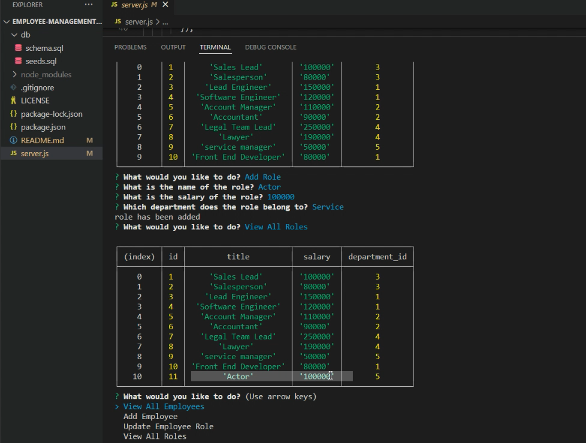

# Employee-Management-System-App

A command-line application that allows to manage a company's employee database

## Table of Contents

- [Description](#description)
- [Walkthrough video link](https://drive.google.com/file/d/13Uq_1dG7J2hRW65FSyGlw0_8wZH42e9A/view?usp=sharing)
- [Installation](#installation)
- [Visuals](#visuals)
- [Technology Used](#technology-used)
- [Questions](#questions)

## Description

A command-line application that allows to manage a company's employee database

## Walkthrough video link

[Link](https://drive.google.com/file/d/13Uq_1dG7J2hRW65FSyGlw0_8wZH42e9A/view?usp=sharing) to video

## Installation

To install this application, clone the code into your terminal for the respective repository. Then, install npm by entering the command `npm init` into the terminal. Inquirer must then be installed by entering `npm install inquirer`. Finally, the program can then be run by entering `node server.js` into the command line, and answering each question appropriately.

## Visuals

## Technology Used

- JavaScript
- Node.js
- Inquirer
- SQL

## Questions

If you have any question about this project you can reach me at anastasiiaciloci@gmail.com
